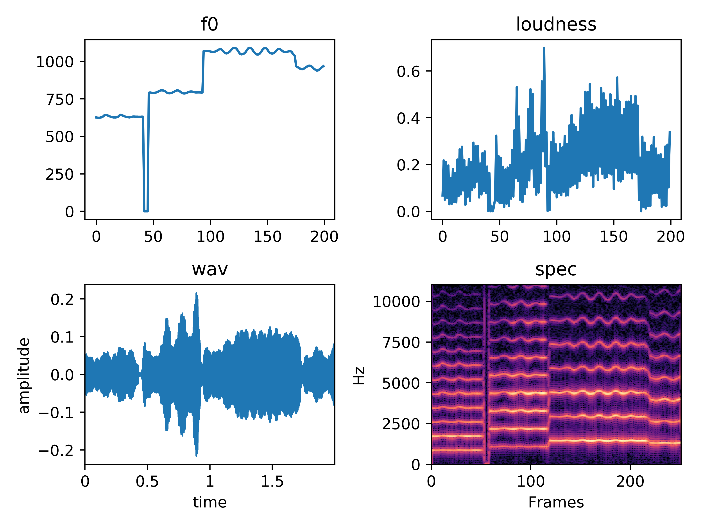

DDSP minimal template in pytorch
---

* **Warning: this repo is not the officail implementation**  
* **Modified from [acids-ircam/ddsp_pytorch](https://github.com/acids-ircam/ddsp_pytorch)**

---

## Progress
* AE Model
* my own coding style for quick realizing my thoughts
* violin (crawled from MusicNet)

## Samples

The results is not satisfactory for lack of training data and data cleansing. 

* [audio samples](assets)
